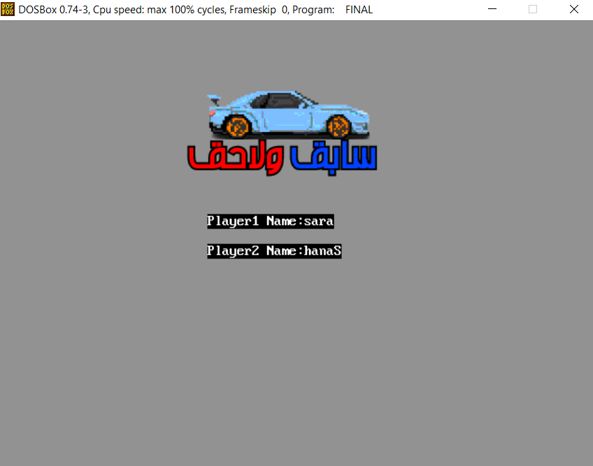
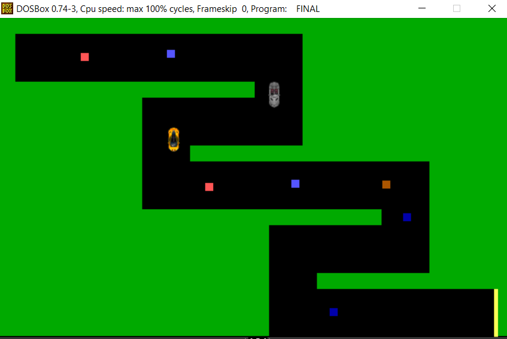

# سابق و لاحق 🏁
Welcome to our x86 Assembly Racing Game! This classic-style racing game brings retro fun to your fingertips. Race against friends either on the same machine or through a local network connection. Dodge obstacles, collect power-ups, and unleash fiery attacks on your opponents as you compete for victory!

## Getting Started: 
1. Clone or download the repository to your local machine. 
2. Navigate to the directory containing the source code.
3. download vs dosbox extesion and run the file with it

## Controls:  
- Arrows to control player 1
- WASD to control player 2
- SPACE to fire power up of player 1
- Y to fire power up of player 2
- Esc: Quit the game.

     

     

     

     

